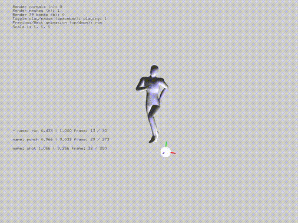
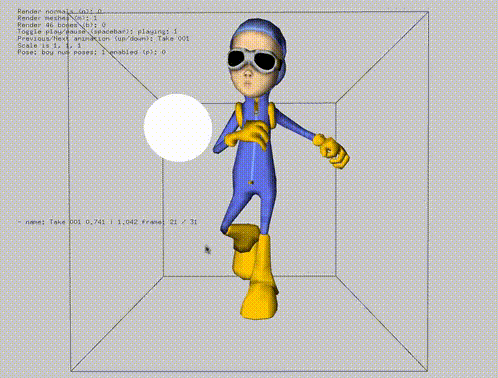
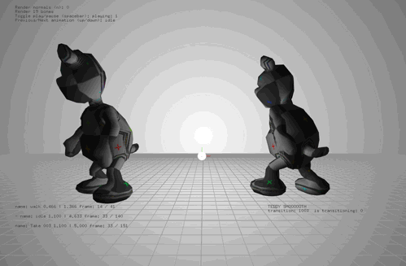
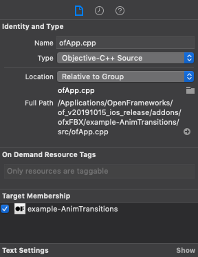

# ofxFBX







Updated to maintain the hierarchy of the fbx file. Added getter / search functions. 
Not compatible with older versions of the addon.
Currently supporting OSX, iOS and Windows Visual Studio. Tested with OF >= v0.10. Please check older releases for compatibility with older versions of OF.

Features include:
* Multiple Animations with individual control
* External Bone Control with Animations
* Linear Bone Animation Blending between two animations
* Define animations
* Textures
* Materials
* Cached meshes and scenes for faster rendering
* Individual mesh manipulation
* Enable and disable rendering of certain assets in the scene
* Caching of mesh animations
* Getter / search functions
* Maintains fbx hierarchy
* Scene caching for faster loading of the same scene multiple times
* Conversion to different units

If you have a fbx with a single animation that needs to be broken up into separate animations, you can try the following:
`mScene.load( "Alligator.FBX", tsettings );`

`mScene.clearAnimations();`

`mScene.addAnimation("SwimBite", 81, 100 );`

`mScene.addAnimation("Swim", 61, 80 );`


### Windows Visual Studio 2017 Notes
To compile in Debug mode, unzip the lib in `ofxFBX/libs/fbxsdk_2016.1/lib/vs/x64/Debug`

### iOS Notes
The example projects include a ofApp.cpp and main.cpp. The project generator will be looking for ofApp.mm and main.mm. Please add the .cpp versions. You will need to tell the compiler to treat them as Objective-C++. Click on ofApp.cpp and then select Objective-C++ from the drop down menu. Do the same for main.cpp. (see below image.)



### Linux
To compile in Debug mode:
```
mkdir fbx20195_fbxsdk_linux
cd fbx20195_fbxsdk_linux
wget https://www.autodesk.com/content/dam/autodesk/www/adn/fbx/20195/fbx20195_fbxsdk_linux.tar.gz
tar xvfz fbx20195_fbxsdk_linux.tar.gz
mkdir installed
chmod +x fbx20195_fbxsdk_linux
./fbx20195_fbxsdk_linux ./installed
cp ./installed/lib/gcc/x86/debug/libfbxsdk.a ${OF_ROOT}/addons/ofxFbx/libs/fbxsdk_2019.5/lib/linux/libfbxsdk.a
cp ./installed/lib/gcc/x64/debug/libfbxsdk.a ${OF_ROOT}/addons/ofxFbx/libs/fbxsdk_2019.5/lib/linux64/libfbxsdk.a

# to switch back to release:
cp ./installed/lib/gcc/x86/release/libfbxsdk.a ${OF_ROOT}/addons/ofxFbx/libs/fbxsdk_2019.5/lib/linux/libfbxsdk.a
cp ./installed/lib/gcc/x64/release/libfbxsdk.a ${OF_ROOT}/addons/ofxFbx/libs/fbxsdk_2019.5/lib/linux64/libfbxsdk.a
```

### Blender workflow. 
Using Blender 2.63, the FBX exporter is not fully featured and there are known bugs that may be fixed in the future.
Apply any transformations before exporting using ctrl + A. http://wiki.blender.org/index.php/User:Fade/Doc:2.6/Manual/3D_interaction/Transform_Control/Reset_Object_Transformations

When exporting, be sure to set the **_Forward_** to **_Y Forward_** and the **_Up_** to **_Z Up_**.


