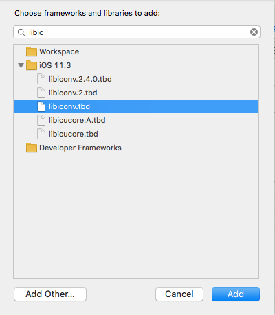

# ofxFBX

Currently supporting OSX, iOS and Windows Visual Studio. Tested with OF v0.10. Please check older releases for compatibility with older versions of OF.

Features include:
* Multiple Animations with individual control
* External Bone Control with Animations
* Linear Bone Animation Blending between two animations
* Textures
* Cameras
* Materials
* Cached meshes and scenes for faster rendering
* Poses
* Individual mesh manipulation
* Enable and disable rendering of certain assets in the scene

### Windows Visual Studio 2017 Notes
Only compiles in Release 64-bit. Not sure why Debug doesn't work. 

### iOS Notes
The example projects include a ofApp.cpp and main.cpp. The project generator will be looking for ofApp.mm and main.mm. Please add the .cpp versions. You will also need to add libiconv.tbd in the Build Phase settings. (see below image.)

### Blender workflow. 
Using Blender 2.63, the FBX exporter is not fully featured and there are known bugs that may be fixed in the future.
Apply any transformations before exporting using ctrl + A. http://wiki.blender.org/index.php/User:Fade/Doc:2.6/Manual/3D_interaction/Transform_Control/Reset_Object_Transformations

When exporting, be sure to set the **_Forward_** to **_Y Forward_** and the **_Up_** to **_Z Up_**.

